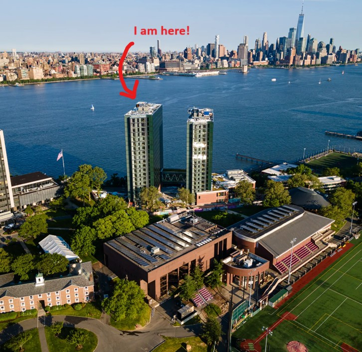

# Engineering Design VI `CPE 322-A`
## Daniel Liss
### Stevens Career
#### *Major*
- **EE** Electrical Engineering

#### *Associated Organizations*
- **C2GS** Computer & Console Gaming Society
- **SHPE Stevens** Society of Hispanic Professional Engineers
- **Stevens IEEE** Institute of Electrical and Electronics Engineers
- **LAA** Latin American Association
- **Creative StoryTelling Club**
---
### Coding Background
#### *Proficiency With Coding Languages*
1. **Python**
2. **C++**
3. **JavaScript**

*Please check out the rest of my GitHub! I have a few projects I am very proud of!*  
[`A FIFA pack opening simulator`](https://github.com/UsuarioDelNet/FifaVSC)  
[`My quick related rates calculator`](https://github.com/UsuarioDelNet/RelatedRatesBeta)  
[`An old vanding machine project from a few years ago`](https://github.com/UsuarioDelNet/VendingMachine)  

---
### CPE 322-A Labs
1. [**Lab 1**](https://github.com/UsuarioDelNet/EngineeringDesign6/tree/main/Labs/Lab1)
2. [**Lab 2**](https://github.com/UsuarioDelNet/EngineeringDesign6/tree/main/Labs/Lab2)
3. [**Lab 3**](https://github.com/UsuarioDelNet/EngineeringDesign6/tree/main/Labs/Lab3)
4. [**Lab 4**]()
5. [**Lab 5**]()
6. [**Lab 6**]()
7. [**Lab 7**]()
8. [**Lab 8**]()
9. [**Lab 9**]()
10. [**Lab 10**]()
11. [**Lab 11**]()

---
### About Me
**My name is:** *Daniel Andres Liss Pan*

**Hobbies?**
I love fútbol! The club I support is my hometown club [Deportivo de La Coruña](https://www.rcdeportivo.es/) , but I follow a ton of different teams. I also play guitar and play a lot of videogames with friends.

**What music I listen to:** I love all styles of music. My Spotify playlist is currently at 1425 songs (and counting)!

[`My Resume`](SourceFolder/ResumeFirstDraft.pdf)
---

